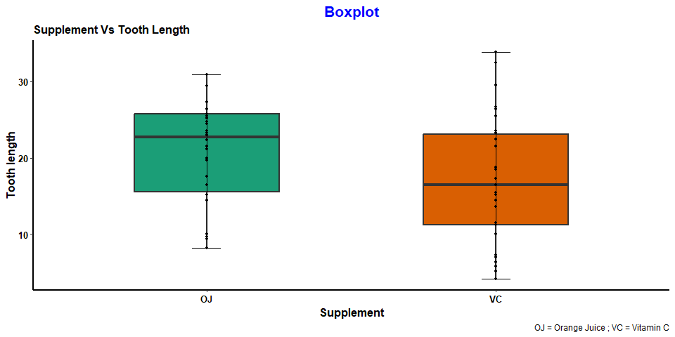
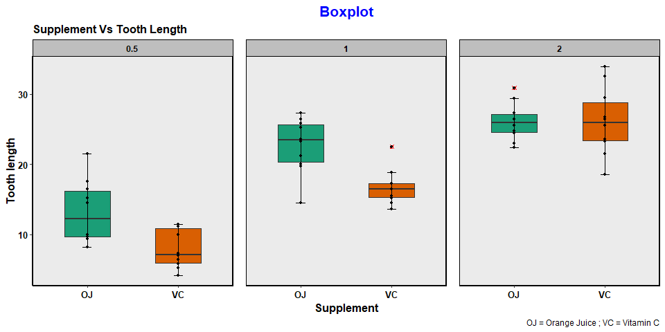
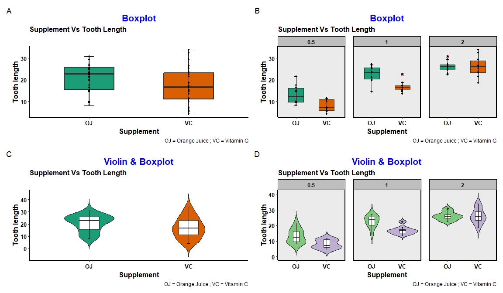

Day_01_scientific_visualization_training
================
By Muhammad Yasir Qurashi
2026-02-25

# Loading libraries

``` r
library(tidyverse)
```

    ## ── Attaching core tidyverse packages ──────────────────────── tidyverse 2.0.0 ──
    ## ✔ dplyr     1.2.0     ✔ readr     2.1.5
    ## ✔ forcats   1.0.1     ✔ stringr   1.5.2
    ## ✔ ggplot2   4.0.2     ✔ tibble    3.3.0
    ## ✔ lubridate 1.9.4     ✔ tidyr     1.3.1
    ## ✔ purrr     1.1.0     
    ## ── Conflicts ────────────────────────────────────────── tidyverse_conflicts() ──
    ## ✖ dplyr::filter() masks stats::filter()
    ## ✖ dplyr::lag()    masks stats::lag()
    ## ℹ Use the conflicted package (<http://conflicted.r-lib.org/>) to force all conflicts to become errors

``` r
library(ggpubr)
library(multcompView)
library(plotly)
```

    ## 
    ## Attaching package: 'plotly'
    ## 
    ## The following object is masked from 'package:ggplot2':
    ## 
    ##     last_plot
    ## 
    ## The following object is masked from 'package:stats':
    ## 
    ##     filter
    ## 
    ## The following object is masked from 'package:graphics':
    ## 
    ##     layout

``` r
library(RColorBrewer)
```

# loading dataset

``` r
TG <- ToothGrowth
View(TG)
```

# Publication ready plots

## 1. Boxplot

### Without facet_wrap

``` r
p1 <- ggplot(data = TG, mapping = aes(x = supp, y = len, fill = supp)) +
  geom_boxplot(linewidth = 0.8, outlier.alpha = 1, outlier.color = "red", outlier.shape = 13, width = 0.5) +
  geom_point(size = 1) +
  labs(x = "Supplement", y = "Tooth length", title = "Boxplot", caption = "OJ = Orange Juice ; VC = Vitamin C", subtitle = "Supplement Vs Tooth Length") +
  theme(
    axis.title = element_text(size = 12, color = "black", face = "bold"),
    axis.text = element_text(size = 10, color = "black", face = "bold"), 
    axis.line = element_line(linewidth = 1, color = "black"),
    plot.title = element_text(size = 16, color = "blue", face = "bold", hjust = 0.5),
    plot.subtitle = element_text(size = 12,face = "bold"),
    legend.background = element_rect(color = "black", fill = "grey"),
    legend.position = "none",
    legend.text = element_text(size = 10, face = "bold"),
    panel.grid.major = element_blank(),
    panel.grid.minor = element_blank(),
    panel.background = element_blank()
  ) +
  stat_boxplot(geom = "errorbar", width = 0.1) +
  scale_fill_brewer(palette = "Dark2");p1
```

<!-- --> \### With
Facet_wrap

``` r
p2 <- ggplot(data = TG, mapping = aes(x = supp, y = len, fill = supp)) +
  geom_boxplot(linewidth = 0.5, outlier.alpha = 1, outlier.color = "red", outlier.shape = 13, width = 0.5) +
  geom_point(size = 1) +
  facet_wrap(~dose) +
  labs(x = "Supplement", y = "Tooth length", title = "Boxplot", caption = "OJ = Orange Juice ; VC = Vitamin C", subtitle = "Supplement Vs Tooth Length") +
  theme(
    axis.title = element_text(size = 12, color = "black", face = "bold"),
    axis.text = element_text(size = 10, color = "black", face = "bold"), 
    plot.title = element_text(size = 16, color = "blue", face = "bold", hjust = 0.5),
    plot.subtitle = element_text(size = 12,face = "bold"),
    legend.background = element_rect(color = "black", fill = "grey"),
    legend.position = "none",
    legend.text = element_text(size = 10, face = "bold",),
    strip.background = element_rect(color = "black", fill = "grey", width = 1),
    strip.text = element_text(color = "black", face = "bold"),
    axis.line = element_line(color = "black", linewidth = 1),
    panel.border = element_rect(linewidth = 1),
    panel.spacing = unit(1, "lines"),
    panel.grid.major = element_blank(),
    panel.grid.minor = element_blank()
  ) +
  stat_boxplot(geom = "errorbar", width = 0.1) +
  scale_fill_brewer(palette = "Dark2");p2
```

    ## Warning in element_rect(color = "black", fill = "grey", width = 1): `...` must be empty.
    ## ✖ Problematic argument:
    ## • width = 1

<!-- -->

## 2. Violin plot + Boxplot

### Without facet_wrap

``` r
p3 <- ggplot(data = TG, mapping = aes( x = supp, y = len, fill = supp)) +
  geom_violin(alpha = 1 , trim = FALSE, width = 0.5) +
  geom_boxplot(fill = "white", width = 0.2) +
  labs(x = "Supplement", y = "Tooth length", title = "Violin & Boxplot", caption = "OJ = Orange Juice ; VC = Vitamin C", subtitle = "Supplement Vs Tooth Length") +
  theme(
    axis.title = element_text(size = 12, color = "black", face = "bold"),
    axis.text = element_text(size = 10, color = "black", face = "bold"), 
    axis.line = element_line(linewidth = 1, color = "black"),
    plot.title = element_text(size = 16, color = "blue", face = "bold", hjust = 0.5),
    plot.subtitle = element_text(size = 12,face = "bold"),
    legend.background = element_rect(color = "black", fill = "grey"),
    legend.position = "none",
    legend.text = element_text(size = 10, face = "bold"),
     panel.grid.major = element_blank(),
    panel.grid.minor = element_blank(),
    panel.background = element_blank()
  ) +
  stat_boxplot(geom = "errorbar", width = 0.03) +
  scale_fill_brewer(palette = "Dark2");p3
```

<!-- --> \### Wit
facet_wrap

``` r
p4 <- ggplot(data = TG, mapping = aes( x = supp, y = len, fill = supp)) +
  geom_violin(alpha = 1 , trim = FALSE, width = 1) +
  geom_boxplot(fill = "white", width = 0.2) +
  facet_wrap(~dose) +
  labs(x = "Supplement", y = "Tooth length", title = "Violin & Boxplot", caption = "OJ = Orange Juice ; VC = Vitamin C", subtitle = "Supplement Vs Tooth Length") +
  theme(
    axis.title = element_text(size = 12, color = "black", face = "bold"),
    axis.text = element_text(size = 10, color = "black", face = "bold"), 
    axis.line = element_line(color = "black", linewidth = 1),
    plot.title = element_text(size = 16, color = "blue", face = "bold", hjust = 0.5),
    plot.subtitle = element_text(size = 12,face = "bold"),
    legend.background = element_rect(color = "black", fill = "grey"),
    legend.position = "none",
    legend.text = element_text(size = 10, face = "bold"),
    strip.background = element_rect(color = "black", fill = "grey", width = 2),
    strip.text = element_text(face = "bold"),
    panel.border = element_rect(linewidth = 1),
    panel.spacing = unit(1, "lines"),
    panel.grid.major = element_blank(),
    panel.grid.minor = element_blank()
  ) +
  stat_boxplot(geom = "errorbar", width = 0.05) +
  scale_fill_brewer(palette = "Accent");p4
```

    ## Warning in element_rect(color = "black", fill = "grey", width = 2): `...` must be empty.
    ## ✖ Problematic argument:
    ## • width = 2

<!-- --> \## 3.
Jitter + Boxplot

``` r
p5 <- ggplot(data = TG, mapping = aes(x = supp , y = len,fill = supp)) +
  geom_jitter(width = 0.5 , alpha = 0.8, size = 2) +
  geom_boxplot(width = 0.5, linewidth = 0.5, alpha = 0.6) +
  stat_boxplot(geom = "errorbar", width = 0.05) +
  labs( x = "Supplement", y = "Tooth Length", title = "Jitter & Boxplot", subtitle = "Supplement Vs ToothLength", caption = "OJ = Orange juice ; VC = Vitamin C" 
          )+
  theme( 
    axis.title = element_text(size = 12, color = "black", face = "bold" ),
    axis.text = element_text(size = 10, color = "black", face = "bold"),
    axis.line = element_line(linewidth = 1, color = "black"),
      plot.title = element_text(size = 16, color = "blue", face = "bold", hjust = 0.5),
    plot.subtitle = element_text(size = 12,face = "bold"),
    legend.background = element_rect(color = "black", fill = "grey"),
    legend.position = "none",
    legend.text = element_text(size = 10, face = "bold"),
    panel.grid.major = element_blank(),
    panel.grid.minor = element_blank(),
    panel.background = element_blank()
    ) +
  stat_compare_means(method = "t.test");p5
```

<!-- -->

``` r
## Save plot

ggsave("Boxplot.tiff",plot = p5, height = 5, width = 7, units = "in", dpi = 600 )
```

# Combine Plot

``` r
library(patchwork)

finalplot <- (p1 | p2 ) / (p3 | p4) +
  plot_annotation(tag_levels = "A");finalplot
```

<!-- -->

Best Regards,

*Muhammad Yasir Qurashi*

Research Data Analysis Tools Mentor
