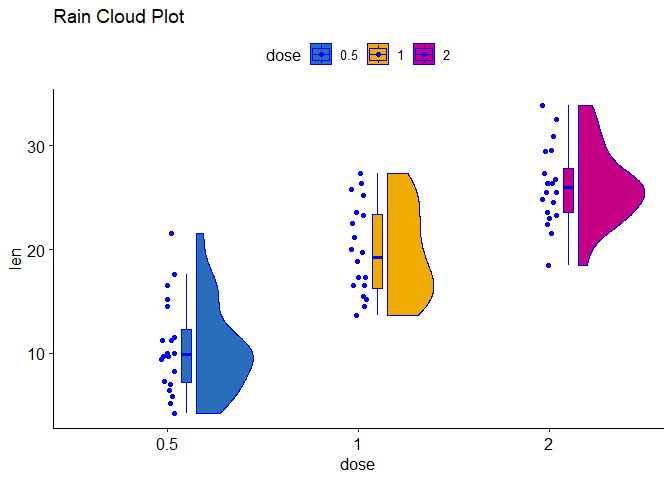
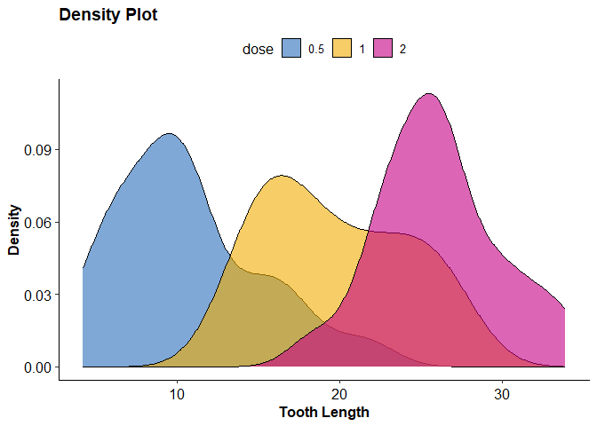
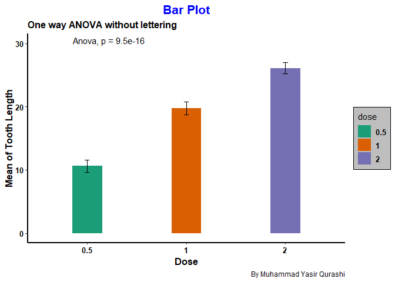
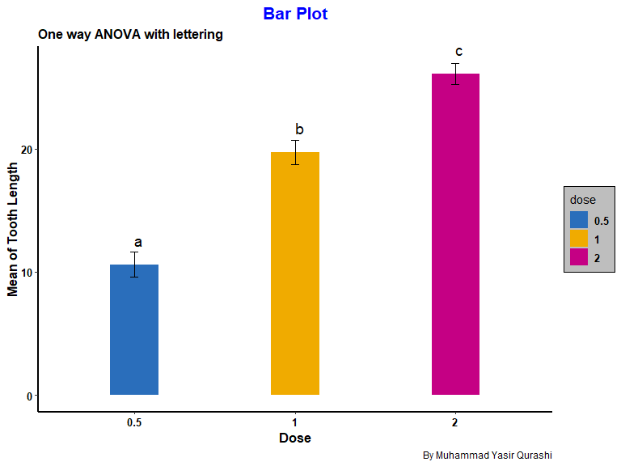
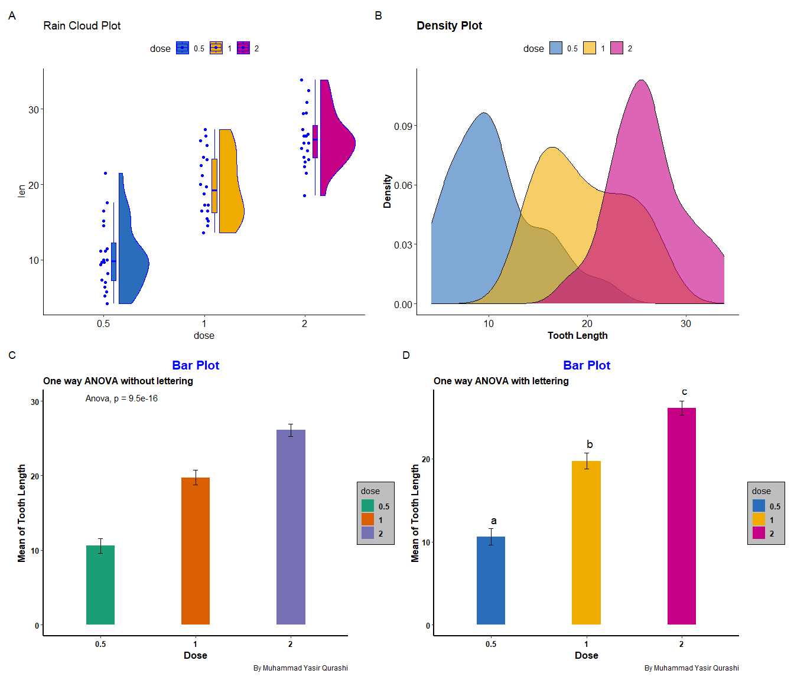

Day_02_scientific_visualization_training
================
By Muhammad Yasir Qurashi
2026-03-02

# One-way ANOVA in R

## Loading_libraries

``` r
library(tidyverse)
```

    ## ── Attaching core tidyverse packages ──────────────────────── tidyverse 2.0.0 ──
    ## ✔ dplyr     1.2.0     ✔ readr     2.1.5
    ## ✔ forcats   1.0.1     ✔ stringr   1.5.2
    ## ✔ ggplot2   4.0.2     ✔ tibble    3.3.0
    ## ✔ lubridate 1.9.4     ✔ tidyr     1.3.1
    ## ✔ purrr     1.1.0     
    ## ── Conflicts ────────────────────────────────────────── tidyverse_conflicts() ──
    ## ✖ dplyr::filter() masks stats::filter()
    ## ✖ dplyr::lag()    masks stats::lag()
    ## ℹ Use the conflicted package (<http://conflicted.r-lib.org/>) to force all conflicts to become errors

``` r
library(ggpubr)
library(multcompView)
library(plotly)
```

    ## 
    ## Attaching package: 'plotly'
    ## 
    ## The following object is masked from 'package:ggplot2':
    ## 
    ##     last_plot
    ## 
    ## The following object is masked from 'package:stats':
    ## 
    ##     filter
    ## 
    ## The following object is masked from 'package:graphics':
    ## 
    ##     layout

``` r
library(RColorBrewer)
library(ggrain)
```

    ## Registered S3 methods overwritten by 'ggpp':
    ##   method                  from   
    ##   heightDetails.titleGrob ggplot2
    ##   widthDetails.titleGrob  ggplot2

``` r
library(ggsci)
```

## Loading dataset

``` r
TG <- ToothGrowth
View(TG)
summary(TG)
```

    ##       len        supp         dose      
    ##  Min.   : 4.20   OJ:30   Min.   :0.500  
    ##  1st Qu.:13.07   VC:30   1st Qu.:0.500  
    ##  Median :19.25           Median :1.000  
    ##  Mean   :18.81           Mean   :1.167  
    ##  3rd Qu.:25.27           3rd Qu.:2.000  
    ##  Max.   :33.90           Max.   :2.000

``` r
TG$dose <- as.factor(TG$dose)
summary(TG)
```

    ##       len        supp     dose   
    ##  Min.   : 4.20   OJ:30   0.5:20  
    ##  1st Qu.:13.07   VC:30   1  :20  
    ##  Median :19.25           2  :20  
    ##  Mean   :18.81                   
    ##  3rd Qu.:25.27                   
    ##  Max.   :33.90

## RainCloud Plot

``` r
p1 <- ggplot(data = TG, mapping = aes(x = dose, y = len, fill = dose)) +
  geom_rain(color = "blue")+
  ggtitle("Rain Cloud Plot")+
  theme_pubr()+
  scale_fill_bmj();p1
```

<!-- -->

## Density plot

``` r
# Basic density plot
p2 <- ggplot(TG, aes(x = len, fill = dose)) +
  geom_density(alpha = 0.6) +
  labs(
    title = "Density Plot",
    x = "Tooth Length",
    y = "Density"
  ) +
  theme_pubr() +
  theme(
    plot.title = element_text(face = "bold"),
    axis.title = element_text(face = "bold")
  )+
  scale_fill_bmj();p2
```

<!-- -->

## Hypothesis testing steps for one-way ANOVA

**1. Make your hypothesis**

null hypothesis –\> there is no significant difference in means of three
groups

alternative –\> there is significant difference in mean of at least one
group

**2. Define your significance level**

alpha = 0.05, C.I = 0.95

**3. Selection of test**

*One way ANOVA*

**4. Calculation**

``` r
# Normality Check ( first condition of ANOVA)

TG %>% 
  group_by(dose) %>% 
  summarise(
  shapiro_p = shapiro.test(len)$p.value
  )
```

    ## # A tibble: 3 × 2
    ##   dose  shapiro_p
    ##   <fct>     <dbl>
    ## 1 0.5       0.247
    ## 2 1         0.164
    ## 3 2         0.902

``` r
 # Data is normal
```

``` r
# Homogenity ( Second Condition for ANOVA)
library(car)
```

    ## Loading required package: carData

    ## 
    ## Attaching package: 'car'

    ## The following object is masked from 'package:dplyr':
    ## 
    ##     recode

    ## The following object is masked from 'package:purrr':
    ## 
    ##     some

``` r
leveneTest(len ~ dose, data = TG, alternative = "two.sided")
```

    ## Levene's Test for Homogeneity of Variance (center = median: "two.sided")
    ##       Df F value Pr(>F)
    ## group  2  0.6457 0.5281
    ##       57

``` r
 # Data is Homogenous too
```

``` r
# ANOVA calculation
results_anova <- aov(len ~ dose, data = TG)
summary(results_anova)
```

    ##             Df Sum Sq Mean Sq F value   Pr(>F)    
    ## dose         2   2426    1213   67.42 9.53e-16 ***
    ## Residuals   57   1026      18                     
    ## ---
    ## Signif. codes:  0 '***' 0.001 '**' 0.01 '*' 0.05 '.' 0.1 ' ' 1

**5. Conclusion**

one way ANOVA has been done with statistical significant results ( n =
60, p_value \< 0.001 )

## Barplot without lettering

``` r
p3 <- ggplot(data = TG, mapping = aes(x = dose, y = len, fill = dose))+
  geom_bar(stat = "summary", fun = "mean", width = 0.3, linewidth = 0.5)+
  geom_errorbar(stat = "summary", fun.data = mean_se, width = 0.05, linewidth = 0.7)+
  labs(x = "Dose", y = "Mean of Tooth Length", title = "Bar Plot", subtitle = "One way ANOVA without lettering", caption = "By Muhammad Yasir Qurashi")+
  stat_compare_means(method = "anova", label.y = 30) +
    theme(
    axis.title = element_text(size = 12, color = "black", face = "bold"),
    axis.text = element_text(size = 10, color = "black", face = "bold"), 
    axis.line = element_line(linewidth = 1, color = "black"),
    plot.title = element_text(size = 16, color = "blue", face = "bold", hjust = 0.5),
    plot.subtitle = element_text(size = 12,face = "bold"),
    legend.background = element_rect(color = "black", fill = "grey"),
    legend.position = "right",
    legend.text = element_text(size = 10, face = "bold"),
     panel.grid.major = element_blank(),
    panel.grid.minor = element_blank(),
    panel.background = element_blank()
  ) +
  scale_fill_brewer(palette = "Dark2");p3
```

<!-- -->

## Barplot with lettering

TO make barplot with significant letters there are four steps given
below:

**1. Step 1**

Find group wise mean

``` r
dose_mean <- TG %>% 
  group_by(dose) %>% 
  summarise(
    mean_len = mean(len),
    quan_len = quantile(len, 0.75)
  );dose_mean
```

    ## # A tibble: 3 × 3
    ##   dose  mean_len quan_len
    ##   <fct>    <dbl>    <dbl>
    ## 1 0.5       10.6     12.2
    ## 2 1         19.7     23.4
    ## 3 2         26.1     27.8

**1. Step 2**

calculation of anova

``` r
anova <- aov(len ~ dose, data = TG)
summary(anova)
```

    ##             Df Sum Sq Mean Sq F value   Pr(>F)    
    ## dose         2   2426    1213   67.42 9.53e-16 ***
    ## Residuals   57   1026      18                     
    ## ---
    ## Signif. codes:  0 '***' 0.001 '**' 0.01 '*' 0.05 '.' 0.1 ' ' 1

**1. Step 3**

Post_hoc test

``` r
tukey <- TukeyHSD(anova)
#View(tukey)
```

**1. Step 4**

Giving Significant Letters

``` r
SL <-  multcompLetters4(anova,tukey)
#View(SL)

SL <- as.data.frame.list(SL$dose)
```

**1. Step 5**

Combine Significant letters with Mean Table

``` r
dose_mean <- cbind(dose_mean, SL = SL$Letters)
#View(dose_mean)
```

# Graphical Representation

``` r
p4 <- ggplot(data = TG, mapping = aes(x = dose, y = len, fill = dose))+
  geom_bar(stat = "summary", fun = "mean", width = 0.3, linewidth = 0.5)+
  geom_errorbar(stat = "summary", fun.data = mean_se, width = 0.05, linewidth = 0.7)+
  geom_text(data = dose_mean, aes(x = dose, y = mean_len, label = SL), size = 5, hjust = 0, vjust = -1.5)+
  labs(x = "Dose", y = "Mean of Tooth Length", title = "Bar Plot", subtitle = "One way ANOVA with lettering", caption = "By Muhammad Yasir Qurashi" )+
    theme(
    axis.title = element_text(size = 12, color = "black", face = "bold"),
    axis.text = element_text(size = 10, color = "black", face = "bold"), 
    axis.line = element_line(linewidth = 1, color = "black"),
    plot.title = element_text(size = 16, color = "blue", face = "bold", hjust = 0.5),
    plot.subtitle = element_text(size = 12,face = "bold"),
    legend.background = element_rect(color = "black", fill = "grey"),
    legend.position = "right",
    legend.text = element_text(size = 10, face = "bold"),
     panel.grid.major = element_blank(),
    panel.grid.minor = element_blank(),
    panel.background = element_blank()
  ) +
  scale_fill_bmj();p4
```

<!-- --> \## Combine
Plot

``` r
library(patchwork)

finalplot <- (p1 | p2 ) / (p3 | p4) +
  plot_annotation(tag_levels = "A");finalplot
```

<!-- -->

Best Regards,

*Muhammad Yasir Qurashi*

Research Data Analysis Tools Mentor
