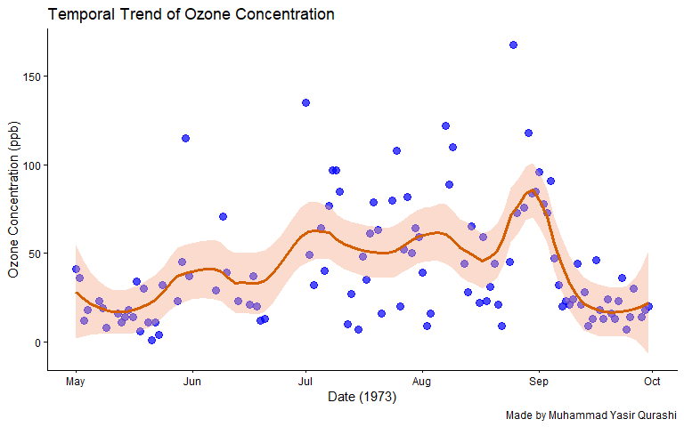
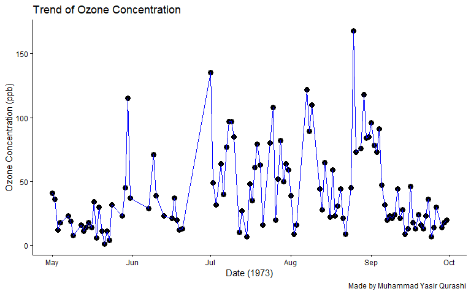
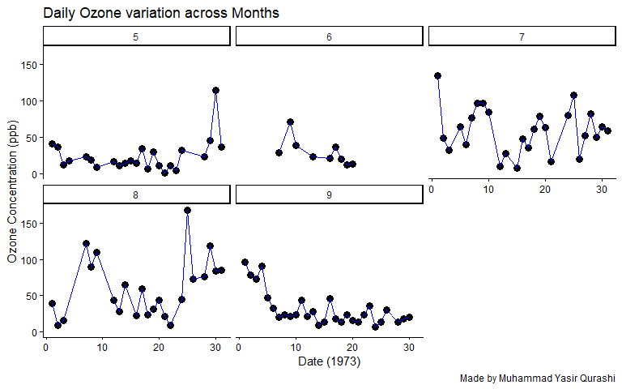
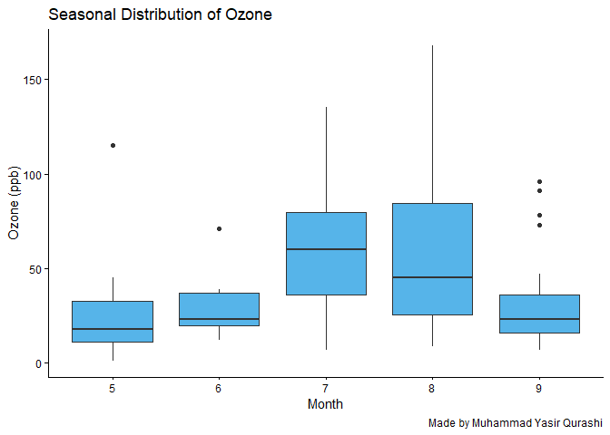
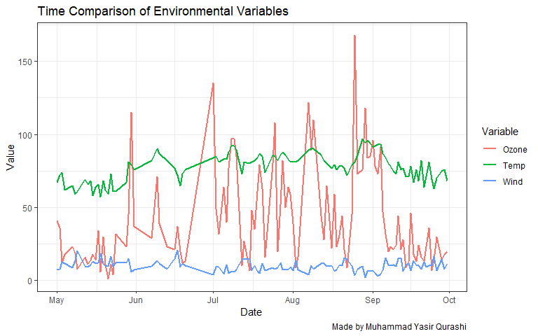
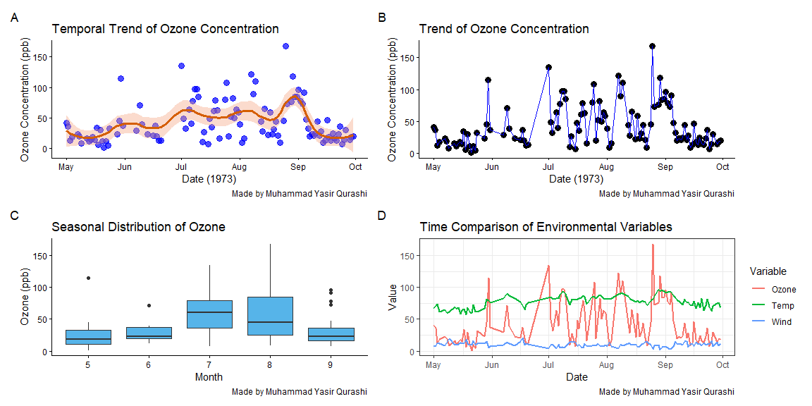

Day_06_scientific_visualization_training
================
By Muhammad Yasir Qurashi
2026-03-11

# **Time Series & Trend Analysis in R**

Time series visualization shows how a variable changes across time.

In research, this helps answer;

- Are values increasing or decreasing over time?

- Is there seasonality?

- Are there anomalies or spikes?

- Are variables moving together or independently?

## Loading dataset

``` r
data("airquality")
head(airquality)
```

    ##   Ozone Solar.R Wind Temp Month Day
    ## 1    41     190  7.4   67     5   1
    ## 2    36     118  8.0   72     5   2
    ## 3    12     149 12.6   74     5   3
    ## 4    18     313 11.5   62     5   4
    ## 5    NA      NA 14.3   56     5   5
    ## 6    28      NA 14.9   66     5   6

``` r
airquality
```

    ##     Ozone Solar.R Wind Temp Month Day
    ## 1      41     190  7.4   67     5   1
    ## 2      36     118  8.0   72     5   2
    ## 3      12     149 12.6   74     5   3
    ## 4      18     313 11.5   62     5   4
    ## 5      NA      NA 14.3   56     5   5
    ## 6      28      NA 14.9   66     5   6
    ## 7      23     299  8.6   65     5   7
    ## 8      19      99 13.8   59     5   8
    ## 9       8      19 20.1   61     5   9
    ## 10     NA     194  8.6   69     5  10
    ## 11      7      NA  6.9   74     5  11
    ## 12     16     256  9.7   69     5  12
    ## 13     11     290  9.2   66     5  13
    ## 14     14     274 10.9   68     5  14
    ## 15     18      65 13.2   58     5  15
    ## 16     14     334 11.5   64     5  16
    ## 17     34     307 12.0   66     5  17
    ## 18      6      78 18.4   57     5  18
    ## 19     30     322 11.5   68     5  19
    ## 20     11      44  9.7   62     5  20
    ## 21      1       8  9.7   59     5  21
    ## 22     11     320 16.6   73     5  22
    ## 23      4      25  9.7   61     5  23
    ## 24     32      92 12.0   61     5  24
    ## 25     NA      66 16.6   57     5  25
    ## 26     NA     266 14.9   58     5  26
    ## 27     NA      NA  8.0   57     5  27
    ## 28     23      13 12.0   67     5  28
    ## 29     45     252 14.9   81     5  29
    ## 30    115     223  5.7   79     5  30
    ## 31     37     279  7.4   76     5  31
    ## 32     NA     286  8.6   78     6   1
    ## 33     NA     287  9.7   74     6   2
    ## 34     NA     242 16.1   67     6   3
    ## 35     NA     186  9.2   84     6   4
    ## 36     NA     220  8.6   85     6   5
    ## 37     NA     264 14.3   79     6   6
    ## 38     29     127  9.7   82     6   7
    ## 39     NA     273  6.9   87     6   8
    ## 40     71     291 13.8   90     6   9
    ## 41     39     323 11.5   87     6  10
    ## 42     NA     259 10.9   93     6  11
    ## 43     NA     250  9.2   92     6  12
    ## 44     23     148  8.0   82     6  13
    ## 45     NA     332 13.8   80     6  14
    ## 46     NA     322 11.5   79     6  15
    ## 47     21     191 14.9   77     6  16
    ## 48     37     284 20.7   72     6  17
    ## 49     20      37  9.2   65     6  18
    ## 50     12     120 11.5   73     6  19
    ## 51     13     137 10.3   76     6  20
    ## 52     NA     150  6.3   77     6  21
    ## 53     NA      59  1.7   76     6  22
    ## 54     NA      91  4.6   76     6  23
    ## 55     NA     250  6.3   76     6  24
    ## 56     NA     135  8.0   75     6  25
    ## 57     NA     127  8.0   78     6  26
    ## 58     NA      47 10.3   73     6  27
    ## 59     NA      98 11.5   80     6  28
    ## 60     NA      31 14.9   77     6  29
    ## 61     NA     138  8.0   83     6  30
    ## 62    135     269  4.1   84     7   1
    ## 63     49     248  9.2   85     7   2
    ## 64     32     236  9.2   81     7   3
    ## 65     NA     101 10.9   84     7   4
    ## 66     64     175  4.6   83     7   5
    ## 67     40     314 10.9   83     7   6
    ## 68     77     276  5.1   88     7   7
    ## 69     97     267  6.3   92     7   8
    ## 70     97     272  5.7   92     7   9
    ## 71     85     175  7.4   89     7  10
    ## 72     NA     139  8.6   82     7  11
    ## 73     10     264 14.3   73     7  12
    ## 74     27     175 14.9   81     7  13
    ## 75     NA     291 14.9   91     7  14
    ## 76      7      48 14.3   80     7  15
    ## 77     48     260  6.9   81     7  16
    ## 78     35     274 10.3   82     7  17
    ## 79     61     285  6.3   84     7  18
    ## 80     79     187  5.1   87     7  19
    ## 81     63     220 11.5   85     7  20
    ## 82     16       7  6.9   74     7  21
    ## 83     NA     258  9.7   81     7  22
    ## 84     NA     295 11.5   82     7  23
    ## 85     80     294  8.6   86     7  24
    ## 86    108     223  8.0   85     7  25
    ## 87     20      81  8.6   82     7  26
    ## 88     52      82 12.0   86     7  27
    ## 89     82     213  7.4   88     7  28
    ## 90     50     275  7.4   86     7  29
    ## 91     64     253  7.4   83     7  30
    ## 92     59     254  9.2   81     7  31
    ## 93     39      83  6.9   81     8   1
    ## 94      9      24 13.8   81     8   2
    ## 95     16      77  7.4   82     8   3
    ## 96     78      NA  6.9   86     8   4
    ## 97     35      NA  7.4   85     8   5
    ## 98     66      NA  4.6   87     8   6
    ## 99    122     255  4.0   89     8   7
    ## 100    89     229 10.3   90     8   8
    ## 101   110     207  8.0   90     8   9
    ## 102    NA     222  8.6   92     8  10
    ## 103    NA     137 11.5   86     8  11
    ## 104    44     192 11.5   86     8  12
    ## 105    28     273 11.5   82     8  13
    ## 106    65     157  9.7   80     8  14
    ## 107    NA      64 11.5   79     8  15
    ## 108    22      71 10.3   77     8  16
    ## 109    59      51  6.3   79     8  17
    ## 110    23     115  7.4   76     8  18
    ## 111    31     244 10.9   78     8  19
    ## 112    44     190 10.3   78     8  20
    ## 113    21     259 15.5   77     8  21
    ## 114     9      36 14.3   72     8  22
    ## 115    NA     255 12.6   75     8  23
    ## 116    45     212  9.7   79     8  24
    ## 117   168     238  3.4   81     8  25
    ## 118    73     215  8.0   86     8  26
    ## 119    NA     153  5.7   88     8  27
    ## 120    76     203  9.7   97     8  28
    ## 121   118     225  2.3   94     8  29
    ## 122    84     237  6.3   96     8  30
    ## 123    85     188  6.3   94     8  31
    ## 124    96     167  6.9   91     9   1
    ## 125    78     197  5.1   92     9   2
    ## 126    73     183  2.8   93     9   3
    ## 127    91     189  4.6   93     9   4
    ## 128    47      95  7.4   87     9   5
    ## 129    32      92 15.5   84     9   6
    ## 130    20     252 10.9   80     9   7
    ## 131    23     220 10.3   78     9   8
    ## 132    21     230 10.9   75     9   9
    ## 133    24     259  9.7   73     9  10
    ## 134    44     236 14.9   81     9  11
    ## 135    21     259 15.5   76     9  12
    ## 136    28     238  6.3   77     9  13
    ## 137     9      24 10.9   71     9  14
    ## 138    13     112 11.5   71     9  15
    ## 139    46     237  6.9   78     9  16
    ## 140    18     224 13.8   67     9  17
    ## 141    13      27 10.3   76     9  18
    ## 142    24     238 10.3   68     9  19
    ## 143    16     201  8.0   82     9  20
    ## 144    13     238 12.6   64     9  21
    ## 145    23      14  9.2   71     9  22
    ## 146    36     139 10.3   81     9  23
    ## 147     7      49 10.3   69     9  24
    ## 148    14      20 16.6   63     9  25
    ## 149    30     193  6.9   70     9  26
    ## 150    NA     145 13.2   77     9  27
    ## 151    14     191 14.3   75     9  28
    ## 152    18     131  8.0   76     9  29
    ## 153    20     223 11.5   68     9  30

| Variable | Description                     |
|----------|---------------------------------|
| Ozone    | Ozone concentration (ppb)       |
| Solar.R  | Solar radiation (Langley units) |
| Wind     | Wind speed (mph)                |
| Temp     | Temperature (°F)                |
| Month    | Month of observation            |
| Day      | Day of observation              |

## Today’s Scientific Questions

- Does ozone pollution increase during summer months?

- Is there a trend between temperature and ozone concentration?

- Do wind patterns reduce pollution levels over time?

## Loading libraries

``` r
library(tidyverse)
```

    ## ── Attaching core tidyverse packages ──────────────────────── tidyverse 2.0.0 ──
    ## ✔ dplyr     1.2.0     ✔ readr     2.1.5
    ## ✔ forcats   1.0.1     ✔ stringr   1.5.2
    ## ✔ ggplot2   4.0.2     ✔ tibble    3.3.0
    ## ✔ lubridate 1.9.4     ✔ tidyr     1.3.1
    ## ✔ purrr     1.1.0     
    ## ── Conflicts ────────────────────────────────────────── tidyverse_conflicts() ──
    ## ✖ dplyr::filter() masks stats::filter()
    ## ✖ dplyr::lag()    masks stats::lag()
    ## ℹ Use the conflicted package (<http://conflicted.r-lib.org/>) to force all conflicts to become errors

``` r
library(RColorBrewer)
library(ggpubr)
library(reshape2)
```

    ## 
    ## Attaching package: 'reshape2'
    ## 
    ## The following object is masked from 'package:tidyr':
    ## 
    ##     smiths

## Data manipulation

``` r
# Creating date column in our dateaset that helps us in time series analysis visualization
airquality <-  airquality %>% 
  drop_na() %>% 
  mutate( date = make_date(1973,Month, Day)
    ) %>% 
  arrange(date);airquality
```

    ##     Ozone Solar.R Wind Temp Month Day       date
    ## 1      41     190  7.4   67     5   1 1973-05-01
    ## 2      36     118  8.0   72     5   2 1973-05-02
    ## 3      12     149 12.6   74     5   3 1973-05-03
    ## 4      18     313 11.5   62     5   4 1973-05-04
    ## 5      23     299  8.6   65     5   7 1973-05-07
    ## 6      19      99 13.8   59     5   8 1973-05-08
    ## 7       8      19 20.1   61     5   9 1973-05-09
    ## 8      16     256  9.7   69     5  12 1973-05-12
    ## 9      11     290  9.2   66     5  13 1973-05-13
    ## 10     14     274 10.9   68     5  14 1973-05-14
    ## 11     18      65 13.2   58     5  15 1973-05-15
    ## 12     14     334 11.5   64     5  16 1973-05-16
    ## 13     34     307 12.0   66     5  17 1973-05-17
    ## 14      6      78 18.4   57     5  18 1973-05-18
    ## 15     30     322 11.5   68     5  19 1973-05-19
    ## 16     11      44  9.7   62     5  20 1973-05-20
    ## 17      1       8  9.7   59     5  21 1973-05-21
    ## 18     11     320 16.6   73     5  22 1973-05-22
    ## 19      4      25  9.7   61     5  23 1973-05-23
    ## 20     32      92 12.0   61     5  24 1973-05-24
    ## 21     23      13 12.0   67     5  28 1973-05-28
    ## 22     45     252 14.9   81     5  29 1973-05-29
    ## 23    115     223  5.7   79     5  30 1973-05-30
    ## 24     37     279  7.4   76     5  31 1973-05-31
    ## 25     29     127  9.7   82     6   7 1973-06-07
    ## 26     71     291 13.8   90     6   9 1973-06-09
    ## 27     39     323 11.5   87     6  10 1973-06-10
    ## 28     23     148  8.0   82     6  13 1973-06-13
    ## 29     21     191 14.9   77     6  16 1973-06-16
    ## 30     37     284 20.7   72     6  17 1973-06-17
    ## 31     20      37  9.2   65     6  18 1973-06-18
    ## 32     12     120 11.5   73     6  19 1973-06-19
    ## 33     13     137 10.3   76     6  20 1973-06-20
    ## 34    135     269  4.1   84     7   1 1973-07-01
    ## 35     49     248  9.2   85     7   2 1973-07-02
    ## 36     32     236  9.2   81     7   3 1973-07-03
    ## 37     64     175  4.6   83     7   5 1973-07-05
    ## 38     40     314 10.9   83     7   6 1973-07-06
    ## 39     77     276  5.1   88     7   7 1973-07-07
    ## 40     97     267  6.3   92     7   8 1973-07-08
    ## 41     97     272  5.7   92     7   9 1973-07-09
    ## 42     85     175  7.4   89     7  10 1973-07-10
    ## 43     10     264 14.3   73     7  12 1973-07-12
    ## 44     27     175 14.9   81     7  13 1973-07-13
    ## 45      7      48 14.3   80     7  15 1973-07-15
    ## 46     48     260  6.9   81     7  16 1973-07-16
    ## 47     35     274 10.3   82     7  17 1973-07-17
    ## 48     61     285  6.3   84     7  18 1973-07-18
    ## 49     79     187  5.1   87     7  19 1973-07-19
    ## 50     63     220 11.5   85     7  20 1973-07-20
    ## 51     16       7  6.9   74     7  21 1973-07-21
    ## 52     80     294  8.6   86     7  24 1973-07-24
    ## 53    108     223  8.0   85     7  25 1973-07-25
    ## 54     20      81  8.6   82     7  26 1973-07-26
    ## 55     52      82 12.0   86     7  27 1973-07-27
    ## 56     82     213  7.4   88     7  28 1973-07-28
    ## 57     50     275  7.4   86     7  29 1973-07-29
    ## 58     64     253  7.4   83     7  30 1973-07-30
    ## 59     59     254  9.2   81     7  31 1973-07-31
    ## 60     39      83  6.9   81     8   1 1973-08-01
    ## 61      9      24 13.8   81     8   2 1973-08-02
    ## 62     16      77  7.4   82     8   3 1973-08-03
    ## 63    122     255  4.0   89     8   7 1973-08-07
    ## 64     89     229 10.3   90     8   8 1973-08-08
    ## 65    110     207  8.0   90     8   9 1973-08-09
    ## 66     44     192 11.5   86     8  12 1973-08-12
    ## 67     28     273 11.5   82     8  13 1973-08-13
    ## 68     65     157  9.7   80     8  14 1973-08-14
    ## 69     22      71 10.3   77     8  16 1973-08-16
    ## 70     59      51  6.3   79     8  17 1973-08-17
    ## 71     23     115  7.4   76     8  18 1973-08-18
    ## 72     31     244 10.9   78     8  19 1973-08-19
    ## 73     44     190 10.3   78     8  20 1973-08-20
    ## 74     21     259 15.5   77     8  21 1973-08-21
    ## 75      9      36 14.3   72     8  22 1973-08-22
    ## 76     45     212  9.7   79     8  24 1973-08-24
    ## 77    168     238  3.4   81     8  25 1973-08-25
    ## 78     73     215  8.0   86     8  26 1973-08-26
    ## 79     76     203  9.7   97     8  28 1973-08-28
    ## 80    118     225  2.3   94     8  29 1973-08-29
    ## 81     84     237  6.3   96     8  30 1973-08-30
    ## 82     85     188  6.3   94     8  31 1973-08-31
    ## 83     96     167  6.9   91     9   1 1973-09-01
    ## 84     78     197  5.1   92     9   2 1973-09-02
    ## 85     73     183  2.8   93     9   3 1973-09-03
    ## 86     91     189  4.6   93     9   4 1973-09-04
    ## 87     47      95  7.4   87     9   5 1973-09-05
    ## 88     32      92 15.5   84     9   6 1973-09-06
    ## 89     20     252 10.9   80     9   7 1973-09-07
    ## 90     23     220 10.3   78     9   8 1973-09-08
    ## 91     21     230 10.9   75     9   9 1973-09-09
    ## 92     24     259  9.7   73     9  10 1973-09-10
    ## 93     44     236 14.9   81     9  11 1973-09-11
    ## 94     21     259 15.5   76     9  12 1973-09-12
    ## 95     28     238  6.3   77     9  13 1973-09-13
    ## 96      9      24 10.9   71     9  14 1973-09-14
    ## 97     13     112 11.5   71     9  15 1973-09-15
    ## 98     46     237  6.9   78     9  16 1973-09-16
    ## 99     18     224 13.8   67     9  17 1973-09-17
    ## 100    13      27 10.3   76     9  18 1973-09-18
    ## 101    24     238 10.3   68     9  19 1973-09-19
    ## 102    16     201  8.0   82     9  20 1973-09-20
    ## 103    13     238 12.6   64     9  21 1973-09-21
    ## 104    23      14  9.2   71     9  22 1973-09-22
    ## 105    36     139 10.3   81     9  23 1973-09-23
    ## 106     7      49 10.3   69     9  24 1973-09-24
    ## 107    14      20 16.6   63     9  25 1973-09-25
    ## 108    30     193  6.9   70     9  26 1973-09-26
    ## 109    14     191 14.3   75     9  28 1973-09-28
    ## 110    18     131  8.0   76     9  29 1973-09-29
    ## 111    20     223 11.5   68     9  30 1973-09-30

## Temporal trend of Ozone Conc.

``` r
p1 <- ggplot(airquality, mapping = aes(x = date, y = Ozone)) +
  geom_point(alpha = 0.7, color = "blue", size = 3) +
  geom_smooth( method = "loess", span = 0.3, se = T, color = "#D55E00",
              fill = "#F4A582", linewidth = 1.2) +
  theme_classic() +
    labs( x = "Date (1973)", y = "Ozone Concentration (ppb)", title = "Temporal Trend of Ozone Concentration",  caption = "Made by Muhammad Yasir Qurashi");p1
```

    ## `geom_smooth()` using formula = 'y ~ x'

<!-- -->

## Trend of Ozone concentration

``` r
p2 <- ggplot(airquality, mapping = aes(x = date, y = Ozone)) +
  geom_point(alpha = 1, fill = "black", size = 3) +
  geom_line(color = "blue") +
  theme_classic() +
    labs( x = "Date (1973)", y = "Ozone Concentration (ppb)", title = "Trend of Ozone Concentration",  caption = "Made by Muhammad Yasir Qurashi");p2
```

<!-- -->

## Ozone variation across months

``` r
p3 <- ggplot(airquality, mapping = aes(x = Day, y = Ozone)) +
  geom_point(alpha = 1, fill = "black", size = 3) +
  geom_line(color = "blue") +
  facet_wrap(~Month) +
  theme_classic() +
    labs( x = "Date (1973)", y = "Ozone Concentration (ppb)", title = "Daily Ozone variation across Months",  caption = "Made by Muhammad Yasir Qurashi");p3
```

<!-- -->

## Seasonal distribution of Ozone

``` r
p4 <- ggplot(airquality, aes(factor(Month), Ozone)) +
  geom_boxplot(fill = "#56B4E9") +
  labs( x = "Month", y = "Ozone (ppb)", title = "Seasonal Distribution of Ozone", caption = "Made by Muhammad Yasir Qurashi") +
  theme_classic();p4
```

<!-- -->

## Data conversion into long_format

``` r
air_long <- airquality %>%
  select(date, Ozone, Temp, Wind) %>%
  pivot_longer(-date)
print(air_long)
```

    ## # A tibble: 333 × 3
    ##    date       name  value
    ##    <date>     <chr> <dbl>
    ##  1 1973-05-01 Ozone  41  
    ##  2 1973-05-01 Temp   67  
    ##  3 1973-05-01 Wind    7.4
    ##  4 1973-05-02 Ozone  36  
    ##  5 1973-05-02 Temp   72  
    ##  6 1973-05-02 Wind    8  
    ##  7 1973-05-03 Ozone  12  
    ##  8 1973-05-03 Temp   74  
    ##  9 1973-05-03 Wind   12.6
    ## 10 1973-05-04 Ozone  18  
    ## # ℹ 323 more rows

## Time comparison of Environmental variables

``` r
p5 <- ggplot(air_long, aes(date, value, color = name)) +
  geom_line(linewidth = 1) +
  labs( x = "Date", y = "Value", color = "Variable", title = "Time Comparison of Environmental Variables", caption = "Made by Muhammad Yasir Qurashi") +
  theme_bw();p5
```

<!-- -->

## Interpretation

Ozone concentrations exhibited a clear temporal trend across the
observation period, with peak levels occurring during mid-summer months.
The LOESS-smoothed curve indicated a gradual increase in ozone
concentrations from May to July followed by a decline toward
September.Seasonal comparison revealed significantly higher ozone
concentrations during July compared with early summer months

## Multipanel figure

``` r
library(patchwork)
final_plot_day_06 <- ( p1 | p2 ) / ( p4 | p5 ) +
  plot_annotation(tag_levels = "A");final_plot_day_06
```

    ## `geom_smooth()` using formula = 'y ~ x'

<!-- -->

Best Regards,

*Muhammad Yasir Qurashi*

Research Data Analysis Tools Mentor
