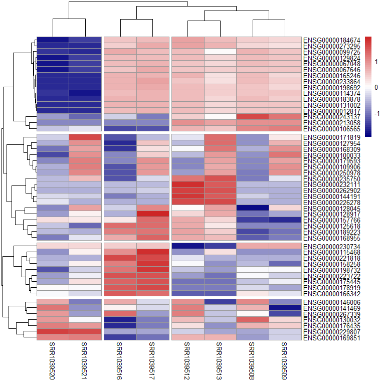
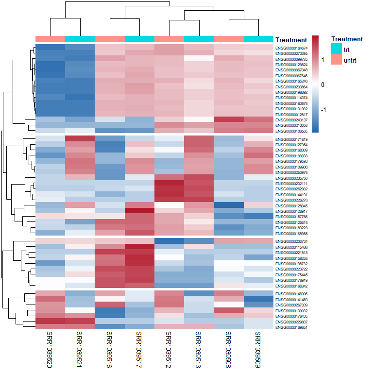

Day_07_scientific_visualization_mastery
================
By Muhammad Yasir Qurashi
2026-03-11

# **Gene Expression Heatmaps**

Research Questions

- Which genes are highly expressed across samples?

- Do treated vs untreated samples cluster differently?

- Which genes respond strongly to treatment?

In this section, we explore RNA-seq gene expression data and learn how
to visualize global expression patterns using heatmap. Heatmaps are
widely used in genomics research because they allow researchers to
observe patterns of gene activity across multiple biological samples
simultaneously.

## **Today’s Goal**

The goal is to transform a gene expression matrix into a
publication-quality heatmap that highlights relationships between genes
and experimental conditions.

## Loading libraries

``` r
library(pheatmap)
library(airway)
```

    ## Loading required package: SummarizedExperiment

    ## Loading required package: MatrixGenerics

    ## Loading required package: matrixStats

    ## 
    ## Attaching package: 'MatrixGenerics'

    ## The following objects are masked from 'package:matrixStats':
    ## 
    ##     colAlls, colAnyNAs, colAnys, colAvgsPerRowSet, colCollapse,
    ##     colCounts, colCummaxs, colCummins, colCumprods, colCumsums,
    ##     colDiffs, colIQRDiffs, colIQRs, colLogSumExps, colMadDiffs,
    ##     colMads, colMaxs, colMeans2, colMedians, colMins, colOrderStats,
    ##     colProds, colQuantiles, colRanges, colRanks, colSdDiffs, colSds,
    ##     colSums2, colTabulates, colVarDiffs, colVars, colWeightedMads,
    ##     colWeightedMeans, colWeightedMedians, colWeightedSds,
    ##     colWeightedVars, rowAlls, rowAnyNAs, rowAnys, rowAvgsPerColSet,
    ##     rowCollapse, rowCounts, rowCummaxs, rowCummins, rowCumprods,
    ##     rowCumsums, rowDiffs, rowIQRDiffs, rowIQRs, rowLogSumExps,
    ##     rowMadDiffs, rowMads, rowMaxs, rowMeans2, rowMedians, rowMins,
    ##     rowOrderStats, rowProds, rowQuantiles, rowRanges, rowRanks,
    ##     rowSdDiffs, rowSds, rowSums2, rowTabulates, rowVarDiffs, rowVars,
    ##     rowWeightedMads, rowWeightedMeans, rowWeightedMedians,
    ##     rowWeightedSds, rowWeightedVars

    ## Loading required package: GenomicRanges

    ## Loading required package: stats4

    ## Loading required package: BiocGenerics

    ## Loading required package: generics

    ## 
    ## Attaching package: 'generics'

    ## The following objects are masked from 'package:base':
    ## 
    ##     as.difftime, as.factor, as.ordered, intersect, is.element, setdiff,
    ##     setequal, union

    ## 
    ## Attaching package: 'BiocGenerics'

    ## The following objects are masked from 'package:stats':
    ## 
    ##     IQR, mad, sd, var, xtabs

    ## The following objects are masked from 'package:base':
    ## 
    ##     anyDuplicated, aperm, append, as.data.frame, basename, cbind,
    ##     colnames, dirname, do.call, duplicated, eval, evalq, Filter, Find,
    ##     get, grep, grepl, is.unsorted, lapply, Map, mapply, match, mget,
    ##     order, paste, pmax, pmax.int, pmin, pmin.int, Position, rank,
    ##     rbind, Reduce, rownames, sapply, saveRDS, table, tapply, unique,
    ##     unsplit, which.max, which.min

    ## Loading required package: S4Vectors

    ## 
    ## Attaching package: 'S4Vectors'

    ## The following object is masked from 'package:utils':
    ## 
    ##     findMatches

    ## The following objects are masked from 'package:base':
    ## 
    ##     expand.grid, I, unname

    ## Loading required package: IRanges

    ## 
    ## Attaching package: 'IRanges'

    ## The following object is masked from 'package:grDevices':
    ## 
    ##     windows

    ## Loading required package: Seqinfo

    ## Loading required package: Biobase

    ## Welcome to Bioconductor
    ## 
    ##     Vignettes contain introductory material; view with
    ##     'browseVignettes()'. To cite Bioconductor, see
    ##     'citation("Biobase")', and for packages 'citation("pkgname")'.

    ## 
    ## Attaching package: 'Biobase'

    ## The following object is masked from 'package:MatrixGenerics':
    ## 
    ##     rowMedians

    ## The following objects are masked from 'package:matrixStats':
    ## 
    ##     anyMissing, rowMedians

``` r
library(tidyverse)
```

    ## ── Attaching core tidyverse packages ──────────────────────── tidyverse 2.0.0 ──
    ## ✔ dplyr     1.2.0     ✔ readr     2.1.5
    ## ✔ forcats   1.0.1     ✔ stringr   1.5.2
    ## ✔ ggplot2   4.0.2     ✔ tibble    3.3.0
    ## ✔ lubridate 1.9.4     ✔ tidyr     1.3.1
    ## ✔ purrr     1.1.0

    ## ── Conflicts ────────────────────────────────────────── tidyverse_conflicts() ──
    ## ✖ lubridate::%within%() masks IRanges::%within%()
    ## ✖ dplyr::collapse()     masks IRanges::collapse()
    ## ✖ dplyr::combine()      masks Biobase::combine(), BiocGenerics::combine()
    ## ✖ dplyr::count()        masks matrixStats::count()
    ## ✖ dplyr::desc()         masks IRanges::desc()
    ## ✖ tidyr::expand()       masks S4Vectors::expand()
    ## ✖ dplyr::filter()       masks stats::filter()
    ## ✖ dplyr::first()        masks S4Vectors::first()
    ## ✖ dplyr::lag()          masks stats::lag()
    ## ✖ ggplot2::Position()   masks BiocGenerics::Position(), base::Position()
    ## ✖ purrr::reduce()       masks GenomicRanges::reduce(), IRanges::reduce()
    ## ✖ dplyr::rename()       masks S4Vectors::rename()
    ## ✖ lubridate::second()   masks S4Vectors::second()
    ## ✖ lubridate::second<-() masks S4Vectors::second<-()
    ## ✖ dplyr::slice()        masks IRanges::slice()
    ## ℹ Use the conflicted package (<http://conflicted.r-lib.org/>) to force all conflicts to become errors

## Loading dataset

## Step 01 Extracting Raw Counts

``` r
data("airway")

counts <- assay(airway) # It extracts the numerical matrix of raw RNA-Seq read counts from the airway experiment object. 
dim(counts)
```

    ## [1] 63677     8

``` r
head(counts)
```

    ##                 SRR1039508 SRR1039509 SRR1039512 SRR1039513 SRR1039516
    ## ENSG00000000003        679        448        873        408       1138
    ## ENSG00000000005          0          0          0          0          0
    ## ENSG00000000419        467        515        621        365        587
    ## ENSG00000000457        260        211        263        164        245
    ## ENSG00000000460         60         55         40         35         78
    ## ENSG00000000938          0          0          2          0          1
    ##                 SRR1039517 SRR1039520 SRR1039521
    ## ENSG00000000003       1047        770        572
    ## ENSG00000000005          0          0          0
    ## ENSG00000000419        799        417        508
    ## ENSG00000000457        331        233        229
    ## ENSG00000000460         63         76         60
    ## ENSG00000000938          0          0          0

## Understanding RNA-seq Data Structure

- RNA-seq experiments measure gene expression levels by counting how
  many sequencing reads map to each gene.

The resulting dataset is typically organized as a gene expression
matrix;

| Component | Meaning                                          |
|-----------|--------------------------------------------------|
| Rows      | Genes                                            |
| Columns   | Biological samples                               |
| Values    | RNA-seq read counts representing gene expression |

Higher values indicate greater transcriptional activity, while lower
values indicate lower gene expression.

In addition to the expression matrix, RNA-seq datasets also include
metadata describing the experimental conditions of each sample (e.g.,
treated vs untreated cells).

``` r
# metadata of the gene expression matrix

 colData(airway)
```

    ## DataFrame with 8 rows and 9 columns
    ##            SampleName     cell      dex    albut        Run avgLength
    ##              <factor> <factor> <factor> <factor>   <factor> <integer>
    ## SRR1039508 GSM1275862  N61311     untrt    untrt SRR1039508       126
    ## SRR1039509 GSM1275863  N61311     trt      untrt SRR1039509       126
    ## SRR1039512 GSM1275866  N052611    untrt    untrt SRR1039512       126
    ## SRR1039513 GSM1275867  N052611    trt      untrt SRR1039513        87
    ## SRR1039516 GSM1275870  N080611    untrt    untrt SRR1039516       120
    ## SRR1039517 GSM1275871  N080611    trt      untrt SRR1039517       126
    ## SRR1039520 GSM1275874  N061011    untrt    untrt SRR1039520       101
    ## SRR1039521 GSM1275875  N061011    trt      untrt SRR1039521        98
    ##            Experiment    Sample    BioSample
    ##              <factor>  <factor>     <factor>
    ## SRR1039508  SRX384345 SRS508568 SAMN02422669
    ## SRR1039509  SRX384346 SRS508567 SAMN02422675
    ## SRR1039512  SRX384349 SRS508571 SAMN02422678
    ## SRR1039513  SRX384350 SRS508572 SAMN02422670
    ## SRR1039516  SRX384353 SRS508575 SAMN02422682
    ## SRR1039517  SRX384354 SRS508576 SAMN02422673
    ## SRR1039520  SRX384357 SRS508579 SAMN02422683
    ## SRR1039521  SRX384358 SRS508580 SAMN02422677

- What Metadata explains

| Variable   | Meaning                   |
|------------|---------------------------|
| SampleName | GEO sample ID             |
| cell       | Cell line used            |
| dex        | Treatment (dexamethasone) |
| albut      | Additional treatment      |
| Run        | Sequencing run ID         |
| avgLength  | Read length               |
| Experiment | Sequencing experiment     |
| Sample     | NCBI sample ID            |
| BioSample  | NCBI biosample            |

- What We Will Do With This Data

From these two tables we can create;

Heatmap (Gene expression patterns)

PCA plot (Sample similarity)

Volcano plot (Significant genes)

MA plot (Expression vs fold change)

These are the four most common genomics figures in Nature / Cell /
Science papers

## Step 02 Filtering rows with non-zero sum

``` r
#  filter rows have non-zero sums

counts_filter <- counts[rowSums(counts) > 0,] 
```

## Step 03 Log transformation

``` r
log_counts <- log2(counts_filter + 1)

# RNA-seq counts are often highly skewed, meaning a few genes have extremely large values, Log transformation compresses large values and stabilizes variance.
```

## Step 04 Selecting top Variable genes

``` r
library(matrixStats)

var_genes <- order( rowVars(log_counts), decreasing = TRUE)[1:50]

heat_data <- log_counts[var_genes, ]
```

## Step 05 Creating Heatmap

``` r
pheatmap( heat_data, scale = "row",
 clustering_distance_rows = "euclidean",
 clustering_distance_cols = "euclidean",
 clustering_method = "complete",
 color = colorRampPalette(
 c("navy", "white", "firebrick3"))(50), cutree_rows = 4, cutree_cols = 3)
```

<!-- -->

## Step 06 Adding annotation

``` r
annotation <- data.frame(Treatment = colData(airway)$dex) # extract dex variable from metadata and dtores it in treatment column
annotation
```

    ##   Treatment
    ## 1     untrt
    ## 2       trt
    ## 3     untrt
    ## 4       trt
    ## 5     untrt
    ## 6       trt
    ## 7     untrt
    ## 8       trt

``` r
rownames(annotation) <- colnames(heat_data)
head(heat_data)
```

    ##                 SRR1039508 SRR1039509 SRR1039512 SRR1039513 SRR1039516
    ## ENSG00000129824  12.242876  12.020980  12.203348  11.295769   12.32334
    ## ENSG00000229807   0.000000   1.584963   1.584963   0.000000    0.00000
    ## ENSG00000114374  10.408330  10.188589  10.632995   9.826548   10.61655
    ## ENSG00000067048  10.558421  10.252665  10.427313   9.768184   10.81538
    ## ENSG00000131002   9.403012   9.306062   9.703904   8.707359   10.09011
    ## ENSG00000012817  10.096715   9.949827  10.293472   9.296916   10.44398
    ##                 SRR1039517 SRR1039520 SRR1039521
    ## ENSG00000129824   12.39874    0.00000   1.584963
    ## ENSG00000229807    0.00000   11.94031  11.571279
    ## ENSG00000114374   10.96506    1.00000   0.000000
    ## ENSG00000067048   11.19967    0.00000   1.584963
    ## ENSG00000131002   10.15987    0.00000   0.000000
    ## ENSG00000012817   10.46659    1.00000   1.000000

## Step 07 Annotated Heatmap

``` r
pheatmap( heat_data, scale = "row",
annotation_col = annotation,
clustering_distance_rows = "euclidean",
clustering_distance_cols = "euclidean",
clustering_method = "complete",
color = colorRampPalette(
c("#2166AC","white","#B2182B") )(100), fontsize_row = 6, fontsize_col = 10, border_color = NA,
cutree_rows = 4)
```

<!-- -->

## Interpretation

When reading the heatmap, look for three things;

- Gene Clusters

Genes grouped together likely share similar biological functions or
pathways.

- Sample Clusters

If treated samples cluster together, it suggests the treatment caused
consistent transcriptional changes.

- Expression Patterns

Red and blue regions highlight genes that are upregulated or
downregulated across samples.

Best Regards,

*Muhammad Yasir Qurashi*

Research Data Analysis Tools Mentor
